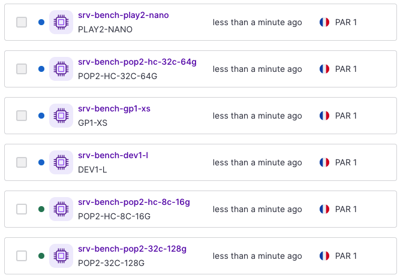
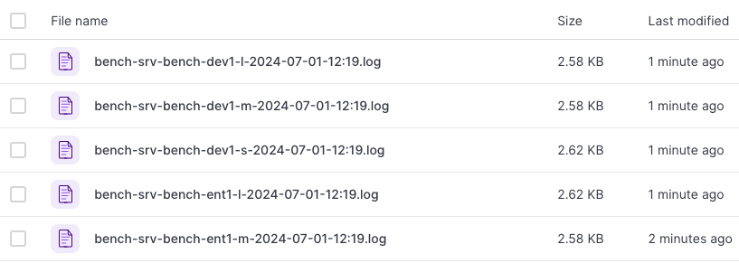

scaleway-benchmark-boilerplate
==============================

This demonstrate a quick way to build a custom image using Packer and deploy it on several instance type to run a benchmark.

Prerequisites:
- install Packer and Terraform cli (ie `brew install hashicorp/tap/packer hashicorp/tap/terraform`)
- install gnu/make if needed (otherwise, just check commands in Makefile)
- create a target Object Storage bucket to receive the benchmark report (and update name in `install.sh`)
- create a Scaleway API key and with object storage and instance rights:
  - update `install.sh` to be used in the image
  - add them as env vars (`SCW_*`) to be used by packer and terraform
- update the `app.sh` script with needed steps to install the application to benchmark. Here, we are installing the PHP Symfony demo app.
- update the `run.sh` script with needed steps for benchmark. The script need to output its results in stdout (here for example, we run apache benchmark).

The list of tested instances are in the terraform manifest. Note that we can't tests x86 and ARM instances with the same image/run.

An image call benchmark is created and several instances are run in parallel. Each instances will auto-destroy after running the benchmark.

The result of the benchmark is uploaded to the object storage bucket.

